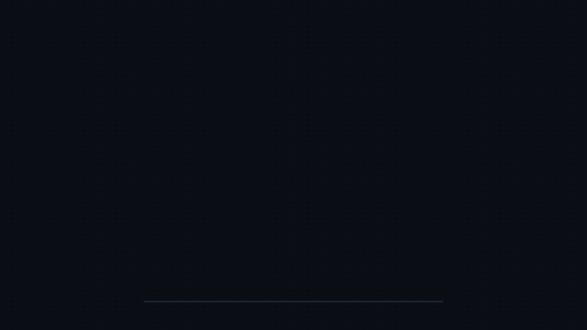

# kamishibai

> **Slice a web page into parallel-capturable units, seek through time, and bake each frame into an mp4. That's it.**
> A *mechanism*, not a framework. How you draw — React, plain DOM, canvas, WebGL — is up to you.



<sub>The [`examples/basics`](examples/basics/index.tsx) reel — spring entrances, staggered bars, multi-stop tracks, color tweens. ([full mp4](examples/basics/out.mp4))</sub>

`kamishibai` turns any web page (DOM, canvas, anything) into a video by **seeking to each moment and capturing a still**, then assembling the stills with `ffmpeg`. Because every frame is a pure function of its time, capture is deterministic and **trivially parallelisable** across several headless Chrome instances.

It deliberately does *not* try to be a frame-accurate compositing engine or ship an editor. It gives you the renderer and one tiny contract; the rest is yours.

- **Free · DOM-or-anything · code/CI-first · AI-friendly · no guarantees (MIT)** — a corner of the programmatic-video space nothing else occupies.
- If you need a guaranteed, frame-accurate media engine, reach for [Remotion](https://www.remotion.dev/) instead.

---

## How it works

### The one and only contract

A capturable page exposes exactly one global:

```ts
window.kamishibai = {
  meta: { fps: 30, durationMs: 6000, width: 1920, height: 1080 },
  // Build the still state for `ms` and resolve once the DOM has settled.
  seek(ms: number): Promise<void>;
};
```

Whatever happens inside `seek` — a React re-render, `ctx.clearRect` + hand-drawing, a Konva `layer.draw()` — is entirely up to you. The renderer just calls `seek(ms)`, screenshots, advances, and repeats. It **never plays back in real time**, so a slow frame takes longer but never drops, and the output is deterministic.

### Parallel capture

A reel of N frames is cut into contiguous chunks of frame indices, and each chunk is captured by its own Chrome. Since frame *i* depends only on its time, it doesn't matter which Chrome renders which chunk:

```
frames 0–684     → Chrome #1 ┐
frames 685–1369  → Chrome #2 ├ run at once → PNG sequence → ffmpeg → mp4
frames 1370–…    → Chrome #3 ┘
```

### Skipping static spans

`seek(ms)` can return `false` to mean "identical to the previous frame". The renderer then copies the previous still instead of paying for a settle + screenshot, cheaply skipping held frames. Returning `void`/`true` captures normally, so existing pages are unaffected.

### Audio

kamishibai never generates sound. You declare files + start times (from a TTS, a music track, anything) and they're muxed at assembly time. Two ways:

**1. An explicit manifest** (CLI `--audio`, or the `audio` render option):

```ts
[
  { src: "voiceover/intro.m4a", atMs: 0 },
  // trim to a sub-section, duck under narration, fade out:
  { src: "bgm.mp3", atMs: 0, gain: -18, trimStartMs: 5000, durationMs: 20000, fadeOutMs: 800 },
]
```

Each clip supports `gain` (dB), `trimStartMs` / `durationMs` (use a sub-section of the file), `fadeInMs` / `fadeOutMs` (fade-out needs `durationMs`), and `gainKeyframes` — dB volume automation over the clip's timeline, linearly interpolated, for ducking/swells:

```ts
// duck the music under narration between 1s and 3s
{ src: "bgm.mp3", atMs: 0, gainKeyframes: [
  { atMs: 0, gain: -10 }, { atMs: 1000, gain: -24 },
  { atMs: 3000, gain: -24 }, { atMs: 3500, gain: -10 },
] }
```

**2. Declared in the page** — composable. The page populates `window.kamishibai.audio` (an array of `{ src, atMs, gain? }`) and the renderer collects + muxes it automatically, no manifest needed. With React this is just an `<Audio>` component dropped into a scene (see below); with the raw API, push entries onto the array yourself.

### Video (frame-accurate)

A raw HTML `<video>` can't be addressed by frame — `video.currentTime` is an approximate, async, decoder-dependent seek, so the same `ms` can yield different frames across runs and break the parallel-determinism invariant. `kamishibai/video` instead demuxes a clip with **mp4box** into an index of *encoded* samples and decodes on demand with **WebCodecs**, and `await frameAtMs(ms)` returns the exact frame — deterministic and frame-accurate, turning a video back into a pure function of time.

```ts
import { loadVideo } from "kamishibai/video";

const clip = await loadVideo("/clip.mp4");  // served via --public, fetchable by the browser
window.kamishibai = {
  meta: { fps: 30, durationMs: 3000, width: 480, height: 270 },
  async seek(ms) {
    const frame = await clip.frameAtMs(ms);
    ctx.clearRect(0, 0, 480, 270);
    if (frame) ctx.drawImage(frame, 0, 0);
  },
};
```

With React, `<Video src>` does this for you (see below), and the clip's **own audio track is muxed automatically** — trimmed to the scene and gain/fade-able — unless you pass `muted`. WebCodecs is available because kamishibai serves on localhost (a secure context). Codec support follows the Chromium build: VP9/AV1 everywhere, H.264 is platform-dependent — prefer VP9/AV1 for portable CI. Only the compressed samples and one decoded GOP are held at a time — frames decode on demand as the render walks forward — so long clips stay memory-bounded instead of decoding the whole clip up front.

---

## Install

```sh
npm install kamishibai
# or: pnpm add kamishibai
```

Requirements:

- **Node.js ≥ 20**
- **`ffmpeg`** on your `PATH` (not bundled — e.g. `brew install ffmpeg`)
- A Chromium for Playwright: `npx playwright install chromium`

---

## CLI

```sh
kamishibai render <entry|url> [options]
```

| Option | | Description |
|---|---|---|
| `--out` | `-o` | output file; `.mp4` (default) or `.gif` by extension |
| `--workers` | `-w` | parallel Chrome instances (default: ~cpus-2, max 8) |
| `--fps` | | override the page's fps — re-samples the same reel at this rate |
| `--scale` | `-s` | device scale factor; output px = meta size × scale (default: 1) |
| `--max-width` | | downscale the output (mp4 or gif) to at most N px wide |
| `--audio` | `-a` | audio manifest JSON: `[{ "src", "atMs", "gain"? }, …]` |
| `--public` | `-p` | static assets dir served at the root (for `staticFile`-style paths) |
| `--frames-dir` | `-f` | write PNG frames here (created if needed; kept after rendering) |
| `--gif-loop` | | gif loops: `0` infinite (default), `-1` once, `n` times |
| (gif fps) | | GIF delays are quantized to 1/100s — pair `.gif` with `--fps` set to a divisor of 100 (25, 50, …) for exact timing |
| `--crf` | | H.264 quality, lower = better (default: 18) |
| `--keep-frames` | | keep the intermediate PNG frames (in the temp dir; path is logged) |
| `--verbose` | | stream ffmpeg output |

The entry can be:

- a **URL** you already serve (`http://localhost:3000`),
- a local **`.html`** file (its directory is served as-is), or
- a local **script** (`.ts` / `.tsx` / `.js` / `.jsx`) — bundled with esbuild and served for you.

```sh
kamishibai render reel.tsx -o reel.mp4 -w 4
kamishibai render reel.tsx -s 2 -o reel@2x.mp4          # 2× resolution
kamishibai render reel.tsx -o reel.gif --fps 25 --max-width 720  # animated GIF
kamishibai render reel.tsx -o reel.mp4 --max-width 1280          # downscaled mp4
kamishibai render http://localhost:3000 -o page.mp4
kamishibai render reel.tsx -a audio.json -p public -o reel.mp4
```

Resolution comes from `meta.width`/`meta.height` (your CSS is authored in those
pixels); `--scale` multiplies only the captured pixels, so a 1920×1080 reel at
`-s 2` outputs 3840×2160 with the same layout.

### `kamishibai skill`

Prints the full usage guide as markdown — meant to be piped into an AI agent's
context (or saved to a file) so it can author reels for you:

```sh
kamishibai skill > kamishibai.md
```

---

## Subtitles

Burn captions in three composable ways — drop `<Subtitle>` into a scene and its cue times count from that scene's start:

```tsx
import { Subtitle, Cue } from "kamishibai/react";

// 1. from an SRT/VTT file (served via --public)
<Subtitle src="/captions.vtt" bottom={60} />

// 2. from inline cues
<Subtitle cues={[{ start: 0, end: 1500, text: "hello" }, { start: 1500, end: 3000, text: "world" }]} />

// 3. direct text — timing via the enclosing <Cue>
<Cue at={500} hold={2000}><Subtitle>just this line</Subtitle></Cue>
```

The parser is also framework-free for the raw API or Node:

```ts
import { parseSubtitles, cueAt } from "kamishibai/subtitle";
const cues = parseSubtitles(srtOrVttText);
const text = cueAt(cues, ms)?.text;            // draw it yourself in seek()
```

---

## Narration (TTS)

TTS is non-deterministic (neural voices resample every call) and billable per request — the two things parallel capture can't tolerate. So kamishibai never synthesizes during `seek()`. Instead `prepareNarration` runs **once, before capture**, as a top-level `await`: it bakes each line to a **content-hashed file**, measures its duration with ffprobe, and hands back `{ src, durationMs, text }`. From then on the reel only references a path — the core contract never learns TTS exists; it rides the existing `<Audio>` mux path. The hash cache (`.kamishibai-tts/`) means identical lines are never re-synthesized or re-billed, and every parallel worker reads the same frozen file — so a non-deterministic API becomes a deterministic file reference.

Because the durations come back before `mount()`, you can size each scene to the line it's about to speak:

```tsx
import { mount, Series, Narration } from "kamishibai/react";
import { sayAdapter, prepareNarration } from "kamishibai/tts";

const voice = sayAdapter();                    // dev default: free, offline, deterministic
const vo = await prepareNarration(voice, {
  intro: "Welcome to kamishibai.",
  body:  "Every frame is a pure function of time.",
});

mount(
  <Series>
    <Series.Scene durationMs={vo.intro.durationMs + 500}>
      <Narration clip={vo.intro} subtitle />   {/* plays the clip AND burns the text as a caption */}
    </Series.Scene>
    <Series.Scene durationMs={vo.body.durationMs + 500}>
      <Narration clip={vo.body} subtitle fadeOutMs={300} />
    </Series.Scene>
  </Series>,
  { fps: 30, durationMs: 9999, width: 1280, height: 720 },
);
```

Adapters are deliberately dumb (`text → bytes`) — no SSML layer, no voice UI. `say` is **macOS-only** (it shells out to the `say` binary), so it's the free local dev default; on Linux/Windows/CI use a network adapter. **Run the dev loop on `say`, then swap one line for the final render** — same reel:

```ts
import { openaiAdapter, googleAdapter, pollyAdapter, elevenLabsAdapter } from "kamishibai/tts";
const voice = openaiAdapter({ model: "tts-1-hd", voice: "nova" });   // OPENAI_API_KEY
const voice = googleAdapter({ name: "en-US-Neural2-F" });            // GOOGLE_API_KEY
const voice = pollyAdapter({ voiceId: "Matthew", engine: "neural" }); // AWS_ACCESS_KEY_ID/SECRET (+AWS_REGION)
const voice = elevenLabsAdapter({ voiceId: "…" });                    // ELEVENLABS_API_KEY
```

(Polly is signed with a minimal built-in SigV4 — no AWS SDK dependency. Google returns base64 audio, decoded for you.)

The adapter sets the voice for the whole batch; a single line can override its options (merged over the adapter's) with the object form — handy to slow one line or switch voices for a quote. The override folds into the cache key, so only that line re-synthesizes:

```ts
const vo = await prepareNarration(sayAdapter(), {
  intro: "Spoken with the default voice.",
  aside: { text: "…but this one, slower.", opts: { rate: 150 } },
});
```

A custom provider implements the Node `TTSAdapter` (`{ provider, synthesize }`) and registers it via `render({ ttsAdapters: [myAdapter] })`; the reel references it with an adapter whose `provider` matches. (Why the split: the reel is bundled for the browser, so its adapter is a serializable ref — `{ id, provider, opts }` — while the actual synthesis runs in Node, served to the page over `POST /__tts`.)

---

## Library

```ts
import { render } from "kamishibai";

await render({
  entry: "reel.tsx",
  out: "reel.mp4",
  workers: 4,
  audio: [{ src: "voiceover.m4a", atMs: 0 }],
  publicDir: "public",
  onLog: (msg) => console.log(msg),
});
```

Lower-level building blocks (`probeMeta`, `captureChunk`, `renderPool`, `serveEntry`, `encodeFrames`, `muxAudio`, `splitFrames`) are exported too if you want to assemble your own pipeline.

---

## React sugar (optional)

You don't need React — any page that sets `window.kamishibai` works. But if you want it, `kamishibai/react` wires a React tree to the contract with a small, deliberately-its-own vocabulary:

```tsx
import { mount, Cue, Enter, ramp, eases, useClock } from "kamishibai/react";

const Reel = () => {
  const { ms } = useClock();        // current time in milliseconds
  const x = ramp(ms, 0, 1000, 0, 400, eases.smooth);
  return (
    <Enter at={200} dur={600}>
      <div style={{ transform: `translateX(${x}px)` }}>hello</div>
    </Enter>
  );
};

mount(<Reel />, { fps: 30, durationMs: 6000, width: 1920, height: 1080 });
```

- `useClock()` — the current clock (`ms`, `durationMs`, `fps`, `epochMs`)
- `ramp` / `eases` / `bezier` — re-exported from [`kamishibai/easing`](#easing) for convenience
- `<Stage>` — root surface · `<Cue at hold>` — reveal during a window (with a local clock) · `<Enter>` — fade + rise
- `<Series>` / `<Series.Scene durationMs crossfadeMs>` — lay scenes back-to-back, each with its own local clock, with optional crossfades
- `<Audio src delayMs atMs gain>` — declare narration/music; starts at the enclosing scene's start (+`delayMs`) or an explicit `atMs`, and is collected for muxing automatically
- `<Video src startMs muted gain fadeInMs fadeOutMs style>` — frame-accurate video via WebCodecs (see [Video](#video-frame-accurate)); draws the clip frame for the current scene-local time, and auto-muxes the clip's audio (use `muted` to drop it)
- `<Subtitle src | cues | children>` — burn captions from an SRT/VTT file, inline cues, or direct text; the active cue for the current scene-local time is drawn (composable — cue times count from the enclosing scene)
- `<Narration clip delayMs gain fadeInMs fadeOutMs subtitle>` — play a clip from `prepareNarration` (synthesized up front, see [Narration](#narration-tts)); with `subtitle`, also burns the line's text as a caption for the clip's window
- `mount(node, meta)` — render and expose `window.kamishibai` for you (also free-runs in a browser for live preview)

```tsx
import { mount, Series, Audio } from "kamishibai/react";

const Movie = () => (
  <Series>
    <Series.Scene durationMs={4000}>
      <Audio src="vo/intro.m4a" delayMs={500} />
      <Intro />
    </Series.Scene>
    <Series.Scene durationMs={6000} crossfadeMs={600}>
      <Audio src="vo/body.m4a" />
      <Body />
    </Series.Scene>
  </Series>
);
```

The vocabulary (`seek` / `ms` / `Cue` / `Stage` / `ramp`) is intentionally distinct from Remotion's — kamishibai is an independent implementation, not a clone.

---

## Easing

`kamishibai/easing` is framework-free — use it from the raw API, the React sugar (which re-exports it), or Node-side code. No DOM or React dependency.

```ts
import { ramp, eases, bezier } from "kamishibai/easing";

ramp(ms, 0, 1000, 0, 400, eases.smooth); // map a time window onto a value
const ease = bezier(0.16, 1, 0.3, 1);    // custom cubic-bezier easing
```

- `bezier(x1, y1, x2, y2)` — build a custom easing (the curve math CSS timing functions use)
- `eases` — ready-made `linear` / `smooth` / `inOut` / `pop`
- `ramp(ms, fromMs, toMs, fromV, toV, ease?)` — clamped time→value interpolation
- `spring({ stiffness, damping, mass })` — a physical spring as an easing (overshoots, settles); analytical, so it's deterministic
- `track(ms, [{ at, value, ease? }])` — multi-stop interpolation (the n-point `ramp`)
- `stagger(i, { each, from })` — cascade delay (ms) for item `i`
- `interpolateColor(a, b, t)` — tween between hex colors

---

## Examples

- **`examples/basics`** — a 6s reel showcasing the `kamishibai/react` sugar: fade in/out, an eased progress meter + count-up, staggered reveals, and eased motion.
- **`examples/video`** — frame-accurate video via WebCodecs, both raw (`index.ts`) and React (`react.tsx`). The clip is an AV1-in-MP4 test pattern generated by ffmpeg (`testsrc`, synthetic — no copyright).
- **`examples/narration`** — TTS as a build pre-pass: synthesize the voice-over up front with `say`, size each scene to its line, and burn the text as captions (`<Narration subtitle>`).

```sh
pnpm build
node dist/cli.js render examples/basics/index.tsx -o basics.mp4 -w 4
node dist/cli.js render examples/video/react.tsx --public examples/video/public -o video.mp4 -w 4
node dist/cli.js render examples/narration/index.tsx -o narration.mp4 -w 4   # macOS `say`
```

---

## Determinism & guarantees

kamishibai does **not** guarantee pixel-identical output across environments. It gives you the levers to make output stable, and the philosophy is to **verify in CI** rather than promise:

- **Fonts are awaited** (`document.fonts.ready`) before the first capture, so text doesn't reflow mid-reel.
- **Pin Chromium** via your Playwright version — emoji and sub-pixel rendering depend on the Chrome build.
- Keep `seek(ms)` a pure function of `ms` (no `Date.now()`, no un-seeded randomness) so any Chrome renders any frame identically.

The intended workflow: pin the environment, render in CI, and let a frame/checksum check fail loudly when something drifts.

---

## License

MIT.

## Name

**紙芝居 (kamishibai)** is a Japanese form of storytelling that advances a tale one picture at a time — precisely this tool's "show one still per moment" approach.
