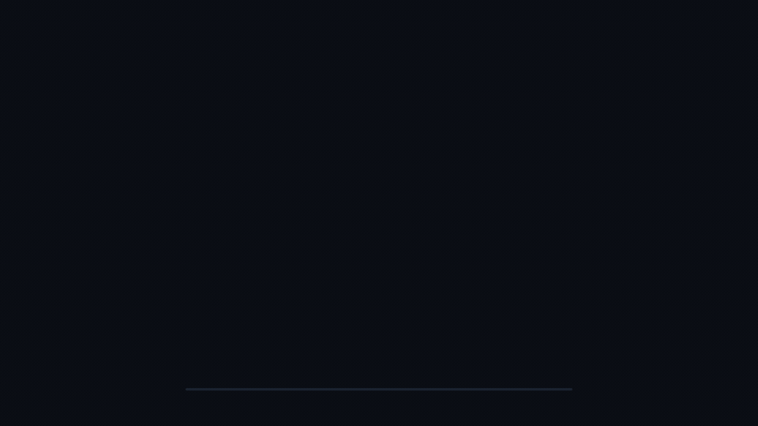

# kamishibai

> **Turn any web page into a video — by making every frame a pure function of its time.**
> A *mechanism*, not a framework. How you draw — React, plain DOM, canvas, WebGL — is up to you.



<sub>The [`examples/basics`](examples/basics/index.tsx) reel — spring entrances, staggered bars, multi-stop tracks, color tweens. ([full mp4](examples/basics/out.mp4))</sub>

`kamishibai` turns any web page (DOM, canvas, anything) into a video by **seeking to each moment and capturing a still**, then assembling the stills with `ffmpeg`. Because every frame is a pure function of its time, capture is deterministic and **trivially parallelisable** across several headless Chrome instances.

It deliberately does *not* try to be a frame-accurate compositing engine or ship an editor. It gives you the renderer and one tiny contract; the rest is yours.

**Free · DOM-or-anything · code/CI-first · AI-friendly · no guarantees (MIT)** — a corner of the programmatic-video space nothing else occupies.

---

## Quick start

```sh
npm i kamishibai react react-dom         # react / react-dom are peer deps
npx playwright install chromium          # the headless browser that captures frames
# plus ffmpeg on your PATH (not bundled) — e.g. `brew install ffmpeg`
```

Write a `reel.tsx` — a page that draws "the state at time `ms`". With the optional React sugar that's just a component plus `mount`:

```tsx
import { mount, useClock, ramp, eases } from "kamishibai/react";

const Reel = () => {
  const { ms } = useClock();                       // current time, in milliseconds
  const x = ramp(ms, 0, 1000, 0, 400, eases.smooth); // map a time window onto a value
  return (
    <div style={{ font: "700 96px system-ui", transform: `translateX(${x}px)` }}>
      hello
    </div>
  );
};

// mount() renders the tree AND exposes window.kamishibai for the renderer.
mount(<Reel />, { fps: 30, durationMs: 3000, width: 1280, height: 720 });
```

Render it:

```sh
npx kamishibai render reel.tsx -o reel.mp4
```

Then iterate: **render → look at the frames → fix the code → render again.** There's no GUI editor — you're the editor.

**Requirements:** Node.js ≥ 20 · `ffmpeg` on `PATH` (not bundled) · a Chromium for Playwright (`npx playwright install chromium`).

---

## Agent skills

Building videos with an AI coding agent? Two installable skills teach it kamishibai — install one or both by name.

Using the [`skills`](https://github.com/vercel-labs/skills) CLI:

```sh
npx skills add reearth/kamishibai --skill kamishibai    # the API / engine
npx skills add reearth/kamishibai --skill video-craft   # the directing / editing craft
npx skills add reearth/kamishibai --all                 # both, all agents, no prompts
```

Or with [`gh skills`](https://cli.github.com/manual/gh_skill) — the GitHub CLI's built-in skill manager (`gh skill`, alias `gh skills`):

```sh
gh skills install reearth/kamishibai kamishibai    # the API / engine
gh skills install reearth/kamishibai video-craft   # the directing / editing craft

# pick the target agent and scope (default: project scope, github-copilot)
gh skills install reearth/kamishibai kamishibai --agent claude-code --scope user

gh skills search kamishibai     # find skills across GitHub
gh skills update --all          # update installed skills
```

- **`kamishibai`** — points the agent at `kamishibai skill`, which prints the full authoring guide (the contract, the React sugar, audio / TTS, the render CLI, determinism) — always matching the installed version.
- **`video-craft`** — the *taste* layer, not the API: narration as the spine, pacing & silence, audio-synced reveals, transitions, mix & ducking, and the outline → script sign-off → pilot → render loop.

Or pipe the guide straight into your agent's context yourself:

```sh
kamishibai skill > kamishibai.md
```

---

## How it works

### The one and only contract

A capturable page exposes exactly one global:

```ts
window.kamishibai = {
  meta: { fps: 30, durationMs: 6000, width: 1920, height: 1080 },
  // Build the still state for `ms` and resolve once the DOM has settled.
  // Return false to mean "identical to the previous frame", or a fingerprint
  // string for the frame's content (see below).
  seek(ms: number): Promise<boolean | string | void> | boolean | string | void;
};
```

Whatever happens inside `seek` — a React re-render, `ctx.clearRect` + hand-drawing, a Konva `layer.draw()` — is entirely up to you. The renderer just calls `seek(ms)`, screenshots, advances, and repeats. It **never plays back in real time**, so a slow frame takes longer but never drops, and the output is deterministic.

### Parallel capture

A reel of N frames is cut into contiguous chunks of frame indices, and each chunk is captured by its own Chrome. Since frame *i* depends only on its time, it doesn't matter which Chrome renders which chunk:

```
frames 0–684     → Chrome #1 ┐
frames 685–1369  → Chrome #2 ├ run at once → PNG sequence → ffmpeg → mp4
frames 1370–…    → Chrome #3 ┘
```

### Skipping static spans

`seek(ms)` can return `false` to mean "identical to the previous frame". The renderer then copies the previous still instead of paying for a settle + screenshot, cheaply skipping held frames. Returning `void`/`true` captures normally, so existing pages are unaffected.

### Incremental builds

`seek(ms)` can also return a **fingerprint** — a stable string key for the frame's content. The renderer copies the previous still when two adjacent prints match (the static-span case, generalized), and with `--incremental` it reuses a cached PNG across runs whenever a print matches the previous run's, stored in `<frames-dir>/.kamishibai-cache.json`. So after you edit a reel, only the frames that actually changed are re-captured; the rest are kept byte-for-byte.

```sh
kamishibai render reel.tsx -f frames -o reel.mp4        # seed the cache
# …edit the reel…
kamishibai render reel.tsx -f frames -i -o reel.mp4     # re-render only what changed
```

`kamishibai/react` returns the fingerprint automatically by hashing the page's DOM (the whole `<body>`, so portals outside the stage count) and the text of every stylesheet rule — so React reels get this for free, no annotation needed. What the hash can't see: `<canvas>`/WebGL pixels, and the bytes behind a URL that didn't change (an image, font or video replaced on disk under the same name). Cover those with a cheap token via `useFingerprint(token)` (`<Video>` already names its frame), or put a version in the URL (`/map.png?v=2`). Matching prints are trusted even without `-i`: within a run, a frame whose print equals the previous frame's is copied, not captured. The cache auto-invalidates when the output geometry (fps/size/scale) changes, and `--only 0-30,90,120-150` is a manual escape hatch that renders just the frames you name. Both need a persisted `--frames-dir`. Caching trusts determinism — a frame that isn't a pure function of its ms can be wrongly reused; omit `-i` for a clean full render.

Once `-i`/`--only` reduce capture to a handful of frames, the **full re-encode** of the PNG sequence becomes the dominant cost (every confirm re-encodes the whole reel, not just the changed frames). For a fast confirm loop, pair the reuse flag with `--preview` (= `--preset ultrafast`), which trades a larger file for a much quicker H.264 pass; drop it for the final render.

```sh
kamishibai render reel.tsx -f frames -i --preview -o reel.mp4   # fast confirm
```

---

## Writing reels — the React sugar

You don't need React — any page that sets `window.kamishibai` works. But `kamishibai/react` wires a React tree to the contract with a small, clock-driven vocabulary:

- `useClock()` — the current clock: `{ ms, durationMs, fps, epochMs }`
- `ramp` / `eases` / `bezier` / `spring` / `track` / `stagger` / `interpolateColor` — re-exported from [`kamishibai/easing`](#easing)
- `<Stage>` — root surface · `<Cue at hold>` — reveal children during a window, with a **local clock** that restarts at 0 · `<Enter>` — fade + rise in
- `<Series>` / `<Series.Scene durationMs crossfadeMs exitFadeMs>` — lay scenes back-to-back, each with its own local clock ([Scenes](#scenes) below)
- `<Audio>` · `<Bgm>` — declare sound ([Audio](#audio)) · `<Video>` — frame-accurate video ([Video](#video-frame-accurate))
- `<Subtitle>` — soft captions, mux-time ([Subtitles](#subtitles)) · `<Narration>` / `<NarrationSteps>` — play pre-synthesized lines ([Narration](#narration-tts))
- `<Camera x y zoom>` / `<Camera shots>` — film a "world" layer: put a world point at the frame center and push in, pan or pull back ([Camera & paths](#camera--paths))
- `mount(node, meta)` — render and expose `window.kamishibai` (also free-runs on the wall clock in a normal browser for live preview)

### Scenes

`<Series>` plays scenes back-to-back, each with its own local clock (so `useClock()` and `<Audio delayMs>` are measured from the scene's start). A `crossfadeMs` overlaps a scene with the previous one: the incoming scene fades in over the outgoing one, which stays fully opaque until it ends. Between two opaque scenes that's a linear mix, and nothing beneath the `<Series>` shows through mid-fade (an incoming scene with no background lets the outgoing one show through it until the outgoing one ends). `exitFadeMs` fades a scene's *content* out, finishing right where the next scene's crossfade begins (so crossfading two different layouts doesn't ghost). Everything the scene renders fades — Stages, their children, and any content outside a Stage — but each `<Stage>` with no other `<Stage>` or `<Series.Scene>` between it and the fading scene leaves an opaque, childless copy of its box (`background` plus `style`, laid out against the full frame) underneath while the content fades, so only the backgrounds blend. The copies stack in tree order, like the Stages. A Stage inside a nested `<Series>` (or another Stage) leaves no copy, so it fades with the content; give the inner scene its own `exitFadeMs` if it needs one. A scene with no Stage fades to whatever is under the `<Series>` until the next scene fades in.

Timings are checked: a negative length, or a `crossfadeMs` longer than either scene it joins, throws a `RangeError` from `seriesLayout` / `seriesDuration` / `<Series>`. Thrown while rendering, it fails the capture with that message. Thrown before `mount()` (e.g. `seriesDuration` in `meta`), it is logged as a page error right away, and the probe fails naming it (with every other distinct error the page threw, in order) once the page-load wait times out (`--probe-timeout`, default 15s of idle time): a page error alone never stops the wait, since the page may still mount.

Markers (`<Audio>`, soft `<Subtitle>`) register when their component mounts, and the renderer only mounts what a sampled frame (`i × 1000 / fps` ms) shows. A `<Cue hold>` or `<Series.Scene>` window shorter than one frame that no frame lands in is mounted hidden for one frame instead (the next frame, or the last frame for a window after it), so its markers still land at their exact times while nothing paints (a `<Stage>` in it leaves no exit-fade copy either). "Frame" means the capture's frame grid: with `--fps`, the page is told the override before it loads.

Scenes **self-register**, so a scene wrapped in your own component works at any depth — there's no "must be a direct child" rule:

```tsx
import { mount, Series, Audio, seriesDuration } from "kamishibai/react";

// Drive a Series from data, and derive meta.durationMs from the same specs so
// the reel can't drift from what renders (a crossfade overlaps, so it shortens
// the timeline — `seriesDuration` accounts for that).
const scenes = [
  { durationMs: 4000, content: <><Audio src="vo/intro.m4a" delayMs={500} /><Intro /></> },
  { durationMs: 6000, crossfadeMs: 600, content: <><Audio src="vo/body.m4a" /><Body /></> },
];

mount(<Series scenes={scenes} />, {
  fps: 30, durationMs: seriesDuration(scenes), width: 1920, height: 1080,
});
```

The JSX form is equivalent — `<Series><Series.Scene durationMs={4000}>…</Series.Scene></Series>` — and `seriesLayout(scenes)` gives the per-scene start times if you need them.

### Camera & paths

`<Camera>` lays its children out in world coordinates and puts the world point `(x, y)` at the frame center, scaled by `zoom` (must be > 0; `cameraAt` throws otherwise), optionally rolled by `rotate` degrees (positive rolls the camera clockwise, so the world turns counter-clockwise on screen). Give it a fixed state, or `shots` — keyframes on the current clock. Between shots the position eases (default `eases.inOut`) and the zoom interpolates in log space, so 1×→4× reads as evenly as 4×→16×. `cameraAt(ms, shots)` is the same math without React.

```tsx
import { Camera } from "kamishibai/react";

<Camera shots={[
  { at: 0,    x: 960,  y: 540, zoom: 1 },   // the whole map
  { at: 2000, x: 1400, y: 300, zoom: 4 },   // push in on one city
  { at: 5000, x: 1400, y: 300, zoom: 4 },   // hold
  { at: 6500, x: 960,  y: 540, zoom: 1 },   // pull back
]}>
  <WorldMap />   {/* drawn in world px, e.g. a 1920×1080 svg at 0,0 */}
</Camera>
```

`kamishibai/path` gives positions along an SVG path — for a dot travelling a route or a particle following a line. It measures with the browser's own `getPointAtLength` on a hidden, cached `<path>` per `d`, so it's exact and deterministic across workers (browser-only):

```tsx
import { pointAt, pointAtLength, pathLength } from "kamishibai/path";

const ROUTE = "M 100 600 C 400 100, 900 100, 1180 600";
const { x, y, angle } = pointAt(ROUTE, ramp(ms, 0, 3000, 0, 1, eases.inOut)); // t: 0..1
```

---

## Easing

`kamishibai/easing` is framework-free — use it from the raw API, the React sugar (which re-exports it), or Node-side code. No DOM or React dependency.

```ts
import { ramp, eases, bezier } from "kamishibai/easing";

ramp(ms, 0, 1000, 0, 400, eases.smooth); // map a time window onto a value
const ease = bezier(0.16, 1, 0.3, 1);    // custom cubic-bezier easing
```

- `bezier(x1, y1, x2, y2)` — build a custom easing (the curve math CSS timing functions use)
- `eases` — ready-made `linear` / `smooth` / `inOut` / `pop`
- `ramp(ms, fromMs, toMs, fromV, toV, ease?)` — clamped time→value interpolation
- `spring({ stiffness, damping, mass })` — a physical spring as an easing (overshoots, settles); analytical, so it's deterministic. `p` is one second of spring time, and like every ease it ends at exactly 1, so a `ramp` lands on its target — any motion left at `p = 1` is taken out linearly, so pick a spring that settles within that second
- `track(ms, [{ at, value, ease? }])` — multi-stop interpolation (the n-point `ramp`)
- `stagger(i, { each, from })` — cascade delay (ms) for item `i`
- `interpolateColor(a, b, t)` — tween between hex colors

---

## Audio

kamishibai never generates sound. You **declare** files + start times — in the page — and they're muxed at assembly time. The page populates `window.kamishibai.audio` (an array of `{ src, atMs, gain?, … }`); the renderer collects and muxes it. With React, drop an `<Audio>` into a scene, or `<Bgm>` at the top level for looped, auto-ducked background music:

```tsx
<Audio src="vo/intro.m4a" delayMs={500} />          {/* starts 500ms into the enclosing scene */}
<Bgm src="theme.mp3" gain={-18} duck fadeOutMs={1500} />  {/* loops under everything, ducks under narration */}
```

Or as a plain array (raw API, or the programmatic `render({ audio })` option):

```ts
[
  { src: "voiceover/intro.m4a", atMs: 0 },
  // a short loop tiled to fill the reel, auto-ducked under the voiceover, fading out at the end:
  { src: "bgm.mp3", atMs: 0, gain: -18, loop: true, duck: true, fadeOutMs: 1500 },
]
```

Per clip: `gain` (dB) · `trimStartMs` / `durationMs` (use a sub-section) · `fadeInMs` / `fadeOutMs` · `loop` (tile the source to the reel length) · `duck` (auto-dip under the non-ducked clips) · `gainKeyframes` (manual dB automation).

**Auto-ducking** derives the dip from the schedule — every clip's start and length are known before the mux, so the music dips while narration plays and rises in the gaps, deterministically (no audio analysis). A ducked clip dips under every *non-ducked* clip (ducked clips never dip under each other); a clip's length is its `durationMs`, else its source file's length after `trimStartMs` (probed with ffprobe at render time), else — for a `loop` clip — the reel end. A clip whose length can't be probed doesn't trigger a dip. `duck: true` uses defaults (−12 dB, 250 ms attack, 600 ms release); tune with `duck: { amountDb: -16, attackMs: 200, releaseMs: 500 }`, or automate by hand with `gainKeyframes`.

`src` is read **from the filesystem by ffmpeg** (cwd-relative or absolute) — unlike `<Video>` / `staticFile` paths, which the *browser* fetches and must be served via `--public`. There's no `--audio` CLI flag (audio belongs to the reel); the programmatic `render({ audio })` option still works and is **merged** with the page's markers — handy for adding audio to a URL entry you don't control.

---

## Video (frame-accurate)

A raw HTML `<video>` can't be addressed by frame — `video.currentTime` is an approximate, async, decoder-dependent seek, so the same `ms` can yield different frames across runs and break the parallel-determinism invariant. `kamishibai/video` instead demuxes a clip with **mp4box** into an index of *encoded* samples and decodes on demand with **WebCodecs**, and `await frameAtMs(ms)` returns the exact frame — deterministic and frame-accurate, turning a video back into a pure function of time.

```ts
import { loadVideo } from "kamishibai/video";

const clip = await loadVideo("/clip.mp4");  // served via --public, fetchable by the browser
window.kamishibai = {
  meta: { fps: 30, durationMs: 3000, width: 480, height: 270 },
  async seek(ms) {
    const frame = await clip.frameAtMs(ms);
    ctx.clearRect(0, 0, 480, 270);
    if (frame) ctx.drawImage(frame, 0, 0);
  },
};
```

With React, `<Video src startMs muted gain fadeInMs fadeOutMs style>` does this for you, and the clip's **own audio track is muxed automatically** — trimmed to the scene and gain/fade-able — unless you pass `muted`. WebCodecs is available because kamishibai serves on localhost (a secure context). Codec support follows the Chromium build: VP9/AV1 everywhere, H.264 is platform-dependent — prefer VP9/AV1 for portable CI. Only the compressed samples and one decoded GOP are held at a time, so long clips stay memory-bounded.

---

## Subtitles

Captions are a **soft track by default**, not pixels. Like `<Audio>`, a `<Subtitle>` *declares* its cues and the renderer bakes them in at mux time — into an mp4 `mov_text` track (toggleable in players) **and** a sidecar `.srt` next to the output. Captions cost no frames, so the captured pixels (and their incremental fingerprints) don't change with the caption text. Drop `<Subtitle>` into a scene three composable ways — cue times count from that scene's start:

```tsx
import { Subtitle, Cue } from "kamishibai/react";

// 1. from an SRT/VTT file (served via --public)
<Subtitle src="/captions.vtt" />

// 2. from inline cues
<Subtitle cues={[{ start: 0, end: 1500, text: "hello" }, { start: 1500, end: 3000, text: "world" }]} />

// 3. direct text — timing via the enclosing <Cue>
<Cue at={500} hold={2000}><Subtitle>just this line</Subtitle></Cue>
```

**Burn-in** (`--burn-subtitles` / `render({ burnSubtitles })`) draws the captions as pixels instead, using the `<Subtitle>` CSS (`bottom`, `style`; and `<Narration subtitleBottom subtitleStyle>`) for full visual control — those props do nothing for the soft track. It's a global switch — soft `mov_text` is plain text styled by the player, so reach for burn-in when you need pixel-perfect captions, or for **GIF output**, which has no subtitle track (gif always burns or drops, and a sidecar `.srt` is still written).

A cue whose end is not after its start can never show, so it's dropped with a warning in both modes (rather than failing the soft-track mux after the capture); the page's `kamishibai:` warnings are printed in the render log. A `src` that fails to load (e.g. a 404) fails the capture in both modes.

The parser/serializer is also framework-free for the raw API or Node:

```ts
import { parseSubtitles, cueAt, cuesToSrt } from "kamishibai/subtitle";
const cues = parseSubtitles(srtOrVttText);
const text = cueAt(cues, ms)?.text;            // draw it yourself in seek()
const srt = cuesToSrt(cues);                   // …or serialize back out
```

---

## Narration (TTS)

TTS is non-deterministic (neural voices resample every call) and billable per request — the two things parallel capture can't tolerate. So kamishibai never synthesizes during `seek()`. Instead `prepareNarration` runs **once, before capture**, as a top-level `await`: it bakes each line to a **content-hashed file**, measures its duration with ffprobe, and hands back `{ src, durationMs, text }`. From then on the reel only references a path — the core contract never learns TTS exists; it rides the existing `<Audio>` mux path. The hash cache (`.kamishibai-tts/`) means identical lines are never re-synthesized or re-billed, and every parallel worker reads the same frozen file — so a non-deterministic API becomes a deterministic file reference.

Because the durations come back before `mount()`, you can size each scene to the line it's about to speak. `narrationLayout` does exactly that — one scene per line, sized to its measured duration — and `seriesDuration` then fits the reel to the voice-over:

```tsx
import { mount, Series, Narration, seriesDuration } from "kamishibai/react";
import { sayAdapter, prepareNarration, narrationLayout } from "kamishibai/tts";

const voice = sayAdapter();                    // dev default: free, offline, deterministic
const vo = await prepareNarration(voice, {
  intro: "Welcome to kamishibai.",
  body:  "Every frame is a pure function of time.",
});

const scenes = narrationLayout([vo.intro, vo.body], { padMs: 500, crossfadeMs: 400 })
  .map(({ clip, ...spec }) => ({
    ...spec,
    content: <Narration clip={clip} subtitle />,  // plays the clip AND adds the text as a caption
  }));

mount(<Series scenes={scenes} />, {
  fps: 30, durationMs: seriesDuration(scenes), width: 1280, height: 720,
});
```

Helpers (`kamishibai/tts`, also re-exported from `kamishibai/react`): `narrationLayout(clips, { padMs, crossfadeMs, exitFadeMs })` → one scene spec per clip (the crossfade isn't clamped: keep `padMs ≥ crossfadeMs`, or a crossfade overlaps the end of the previous line's audio and, past a scene's length, `seriesDuration` / `<Series>` throw a `RangeError`) · `narrationTotal(clips)` → total voice-over length · `narrationSequence(clips, { gapMs, startMs })` → cumulative start offsets for several lines in one scene (reveal element X when line Y starts via `<Cue at={atMs}>`), with `gapMs` as a number, array, or `(i, clip) => ms` for uneven pacing · `narrationScene(clips, { leadMs, gapMs, tailMs })` → `{ steps, durationMs }`, the "several lines in one scene" shape in one call.

`<NarrationSteps steps subtitle />` places a `<Narration>` (audio + caption) at each step's `atMs`, so a multi-line scene is three lines:

```tsx
const s = narrationScene([vo.what, vo.why, vo.how], { leadMs: 300, gapMs: 400, tailMs: 800 });
const scene = {
  durationMs: s.durationMs,
  content: <>
    <NarrationSteps steps={s.steps} subtitle />
    {s.steps.map((step, i) => <Cue key={i} at={step.atMs}><Bullet>{labels[i]}</Bullet></Cue>)}
  </>,
};
```

Adapters are deliberately dumb (`text → bytes`) — no SSML layer, no voice UI. `say` is **macOS-only** (it shells out to the `say` binary), so it's the free local dev default; on Linux/Windows/CI use a network adapter. **Run the dev loop on `say`, then swap one line for the final render** — same reel:

```ts
import { openaiAdapter, googleAdapter, geminiAdapter, pollyAdapter, elevenLabsAdapter } from "kamishibai/tts";
const voice = openaiAdapter({ model: "tts-1-hd", voice: "nova" });    // OPENAI_API_KEY
const voice = googleAdapter({ name: "en-US-Neural2-F" });             // GOOGLE_API_KEY
const voice = geminiAdapter({ voice: "Kore" });                       // GEMINI_API_KEY (falls back to GOOGLE_API_KEY)
const voice = pollyAdapter({ voiceId: "Matthew", engine: "neural" }); // AWS_ACCESS_KEY_ID/SECRET (+AWS_REGION)
const voice = elevenLabsAdapter({ voiceId: "…" });                    // ELEVENLABS_API_KEY
```

(Polly is signed with a minimal built-in SigV4 — no AWS SDK dependency. Google returns base64 audio, decoded for you; Gemini returns raw PCM, wrapped as WAV.)

The adapter sets the voice for the whole batch; a single line can override its options (merged over the adapter's) with the object form. The override folds into the cache key, so only that line re-synthesizes — and changing `voice`/`model` busts *every* line. **Finalize the narration text first, then iterate on timing/visuals** (those are free); text and voice changes cost money.

```ts
const vo = await prepareNarration(sayAdapter(), {
  intro: "Spoken with the default voice.",
  aside: { text: "…but this one, slower.", opts: { rate: 150 } },
});
```

**Reading vs. caption.** What the voice should *say* and what the caption should *show* often differ (Japanese readings, acronyms). Pass a `lexicon` to substitute readings in the spoken text only, or give a line an explicit `caption`; the clip's `text` (used by `<Narration subtitle>`) is always the caption. Only the spoken text is hashed, so editing a caption never re-synthesizes. Lexicon matching is one left-to-right pass where the longest key *starting at each position* wins — so with `{ "京都": …, "都庁舎": … }`, "東京都庁舎" matches `京都` first; add a key for the whole word to pin its reading.

```ts
const vo = await prepareNarration(voice, {
  a: "町字の単位で集計します",                              // spoken: まちあざの単位で…
  b: { text: "パブサブで配信", caption: "Pub/Sub で配信" },  // explicit per-line caption
}, { lexicon: { "町字": "まちあざ", "Pub/Sub": "パブサブ" } });
```

**Long narration.** The first synthesis of many lines can take minutes. The page-load wait only counts *idle* time — while lines are still synthesizing it keeps waiting, and `Synthesizing narration…` / `…narration 12/72 line(s)` show progress. To pay for (and check) every line up front, run `kamishibai tts reel.tsx` — it loads the page once to fill the cache and stops, so the render that follows reads every line from cache. If a line fails, the run stops as soon as nothing else is in flight, with the provider's error and how many lines finished; finished lines are cached, so re-running resumes. Durations are measured with ffprobe (it ships with ffmpeg), so it must be on PATH — a clip it can't read fails its line rather than coming back as 0 ms. A clip ffprobe reports as invalid data is never kept in the cache (a cached one is deleted), so re-running synthesizes that line again. If ffprobe fails for any other reason (missing from PATH, failing to start, permission denied, a crash), the line fails too but the clip is kept — a freshly synthesized one included, so the paid audio isn't lost — and the next run measures it once ffprobe works.

A custom provider implements the Node `TTSAdapter` (`{ provider, synthesize }`) and registers it via `render({ ttsAdapters: [myAdapter] })`; the reel references it with an adapter whose `provider` matches. (Why the split: the reel is bundled for the browser, so its adapter is a serializable ref — `{ id, provider, opts }` — while the actual synthesis runs in Node, served to the page over `POST /__tts`.)

---

## CLI

```sh
kamishibai render <entry|url> [options]
```

| Option | | Description |
|---|---|---|
| `--out` | `-o` | output file; `.mp4` (default) or `.gif` by extension |
| `--workers` | `-w` | parallel Chrome instances (default: ~cpus-2, max 8) |
| `--fps` | | override the page's fps — re-samples the same reel at this rate |
| `--scale` | `-s` | device scale factor; output px = meta size × scale (default: 1) |
| `--max-width` | | downscale the output (mp4 or gif) to at most N px wide |
| `--public` | `-p` | static assets dir served at the root (for `staticFile`-style paths); the entry's own files win on a name clash |
| `--frames-dir` | `-f` | write PNG frames here (created if needed; kept after rendering) |
| `--incremental` | `-i` | reuse cached frames; re-render only changed ones (needs `--frames-dir`) |
| `--only` | | render only these frames, e.g. `0-30,90,120-150` (needs `--frames-dir`) |
| `--burn-subtitles` | | burn captions into the frames instead of a soft track + sidecar `.srt` |
| `--gif-loop` | | gif loops: `0` infinite (default), `-1` once, `n` times |
| `--crf` | | H.264 quality `0`–`51`, lower = better (default: 18) |
| `--preset` | | libx264 speed preset (`ultrafast`…`veryslow`); speeds up the mp4 encode (mp4 only) |
| `--preview` | | shortcut for `--preset ultrafast` — a fast confirm encode |
| `--encode-args` | | raw ffmpeg args for the video encode pass, e.g. `"-tune animation"` (mp4 only) |
| `--mux-args` | | raw ffmpeg args for the audio/subtitle mux pass, e.g. `"-movflags +faststart"` (mp4 only) |
| `--probe-timeout` | | seconds to wait for the page to expose `window.kamishibai` with nothing in progress (default: 15); narration still synthesizing doesn't count |
| `--keep-frames` | | keep the intermediate PNG frames (in the temp dir; path is logged) |
| `--verbose` | | stream ffmpeg output |

The entry can be a **URL** you already serve (`http://localhost:3000`), a local **`.html`** file (its directory is served as-is), or a local **script** (`.ts` / `.tsx` / `.js` / `.jsx`) — bundled with esbuild and served for you. A URL is loaded untouched, so `--public`, `--burn-subtitles` and narration (TTS) only work with an `.html` or script entry; the CLI warns when you pass them with a URL.

Not every subcommand reads every flag: `capture` takes the capture-time ones (`-w`, `--fps`, `-s`, `-p`, `-f`, `-i`, `--only`, `--burn-subtitles`, `--probe-timeout`), `encode` the encode-time ones (`-o`, `-f`, `--fps`, `--max-width`, `--gif-loop`, `--crf`, `--preset`/`--preview`, `--encode-args`, `--mux-args`, `--verbose`), `tts` only `-p` and `--probe-timeout`, and `render` all of them. A flag the subcommand doesn't use is ignored with a warning.

```sh
kamishibai render reel.tsx -o reel.mp4 -w 4
kamishibai render reel.tsx -s 2 -o reel@2x.mp4                   # 2× resolution
kamishibai render reel.tsx -o reel.gif --fps 25 --max-width 720 # animated GIF
kamishibai render reel.tsx -p public -o reel.mp4                # serve ./public at the root
kamishibai render reel.tsx -f frames -i --preview -o reel.mp4   # fast confirm encode
kamishibai render reel.tsx --encode-args "-tune animation" -o reel.mp4
kamishibai render http://localhost:3000 -o page.mp4
```

Resolution comes from `meta.width`/`meta.height` (your CSS is authored in those pixels); `--scale` multiplies only the captured pixels, so a 1920×1080 reel at `-s 2` outputs 3840×2160 with the same layout. GIF frame delays are quantized to 1/100s, so pair `.gif` with `--fps` set to a divisor of 100 (25, 50, …) for exact timing.

`--encode-args` and `--mux-args` are raw ffmpeg escape hatches, kept separate because the two passes differ: the **encode** pass compresses the PNGs to H.264 (`-tune`, `-x264-params`, `-profile:v`), while the **mux** pass stream-copies that video while adding audio/subtitles (`-c:a`, `-movflags`). Each string is appended just before the output, so it can override the built-in flags; it's split on whitespace, so quote the whole string.

### Splitting a render: `capture` + `encode`

A render is **capture** (seek the page into PNG frames) then **encode** (frames into a video). `render` does both, and the two halves are also their own subcommands — so you can capture once and re-encode many times:

```sh
kamishibai capture reel.tsx -f frames                   # frames + manifest + mux sidecar, no video
kamishibai encode  -f frames -o reel.mp4                # frames → video, no browser
kamishibai capture reel.tsx -f frames --only 120-130    # re-shoot a few frames to look at, no mp4
```

`render reel.tsx -f frames -o out.mp4` is exactly those two in sequence. `encode` rebuilds the video from the dir — **no browser, no capture, just ffmpeg** — and replays the mux sidecar a full capture left (the ducked audio clips with srcs resolved to absolute paths, so `encode` works from any cwd, and the soft subtitle cues), so audio and captions come back without re-capturing. It's the fastest path when the PNGs are already correct and you only want different encode/mux settings (`--crf`, `--preset`/`--preview`, `--max-width`, `--encode-args`, or a `.gif`). fps comes from the dir's manifest; `--fps` here re-times the kept frames (a speed change, not a re-sample like on `render`); a `--only` capture leaves the sidecar untouched (its markers are partial), so `render --only` muxes that same sidecar, and a dir of raw PNGs with no usable sidecar encodes silent (the log says whether it was missing, unreadable, or from another version). The PNGs must run gap-free from `f000000.png` — `encode` refuses a sequence with a missing frame, since ffmpeg would stop at it.

`--only` fills in frames of a prior full capture, so it refuses a dir captured at a different fps/size/scale (re-capture without `--only` first), and a range that starts past the last frame is an error. With `-i`/`--only`, frames past the reel's end (from an earlier, longer run) are removed.

```sh
kamishibai encode -f frames --preview -o preview.mp4    # re-encode fast, audio + subs intact
kamishibai encode -f frames --crf 28 -o smaller.mp4     # try a setting without re-capturing
```

`kamishibai tts reel.tsx` is a third, smaller half: it only runs the narration pre-pass (load the page once, synthesize uncached lines into `.kamishibai-tts/`), with no capture or encode. It needs a script or `.html` entry: a URL entry is served by its own server, so its narration requests never reach kamishibai.

For long jobs, capture and encode each print a `…captured X/total` / `…encoded X/total` heartbeat at most once a minute, so a slow reel shows it's advancing; short jobs finish before the first tick and stay quiet.

---

## Library

```ts
import { render } from "kamishibai";

await render({
  entry: "reel.tsx",
  out: "reel.mp4",
  workers: 4,
  audio: [{ src: "voiceover.m4a", atMs: 0 }], // merged with any page-declared audio
  publicDir: "public",
  onLog: (msg) => console.log(msg),
});
```

`render` is just `capture` then `assemble`, and both are exported: `capture({ entry, framesDir })` captures frames (+ manifest + mux sidecar) without encoding, and `encode({ framesDir, out })` re-assembles a kept frames dir into a video without re-capturing (the programmatic forms of the subcommands above). Lower-level building blocks (`probeMeta`, `captureChunk`, `renderPool`, `serveEntry`, `encodeFrames`, `muxAudio`, `assemble`, `splitFrames`) are exported too if you want to assemble your own pipeline.

---

## Examples

- **`examples/basics`** — a 6s reel showcasing the `kamishibai/react` sugar: fade in/out, an eased progress meter + count-up, staggered reveals, and eased motion.
- **`examples/video`** — frame-accurate video via WebCodecs, both raw (`index.ts`) and React (`react.tsx`). The clip is an AV1-in-MP4 test pattern generated by ffmpeg (`testsrc`, synthetic — no copyright).
- **`examples/narration`** — TTS as a build pre-pass: synthesize the voice-over up front with `say`, size each scene to its line with `narrationLayout`, and add the text as captions.

```sh
pnpm build
node dist/cli.js render examples/basics/index.tsx -o basics.mp4 -w 4
node dist/cli.js render examples/video/react.tsx --public examples/video/public -o video.mp4 -w 4
node dist/cli.js render examples/narration/index.tsx -o narration.mp4 -w 4   # macOS `say`
```

---

## Determinism & guarantees

kamishibai does **not** guarantee pixel-identical output across environments. It gives you the levers to make output stable, and the philosophy is to **verify in CI** rather than promise:

- **Fonts are awaited** (`document.fonts.ready`) before the first capture, so text doesn't reflow mid-reel.
- **Pin Chromium** via your Playwright version — emoji and sub-pixel rendering depend on the Chrome build.
- Keep `seek(ms)` a pure function of `ms` (no `Date.now()`, no un-seeded randomness) so any Chrome renders any frame identically.

The intended workflow: pin the environment, render in CI, and let a frame/checksum check fail loudly when something drifts.

---

## License

MIT.

## Name

**紙芝居 (kamishibai)** is a Japanese form of storytelling that advances a tale one picture at a time — precisely this tool's "show one still per moment" approach.
